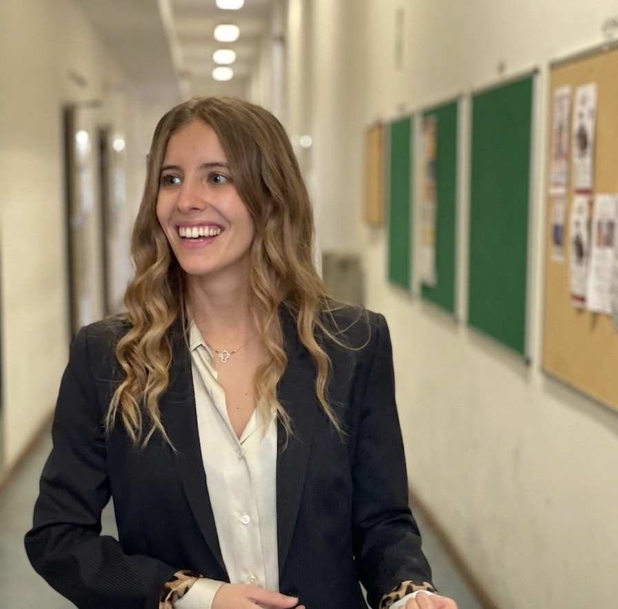
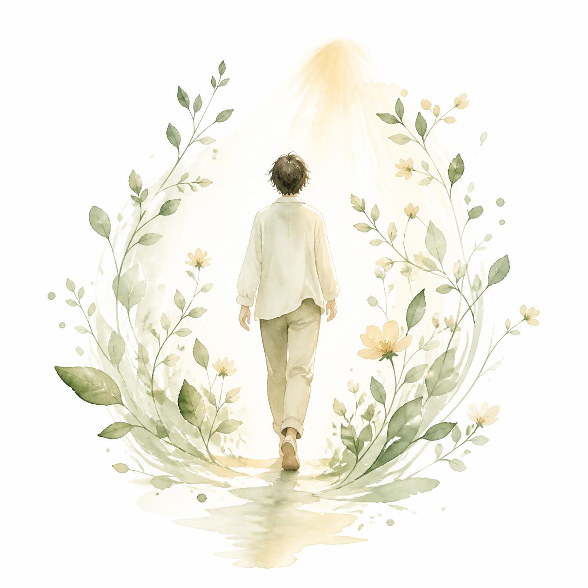
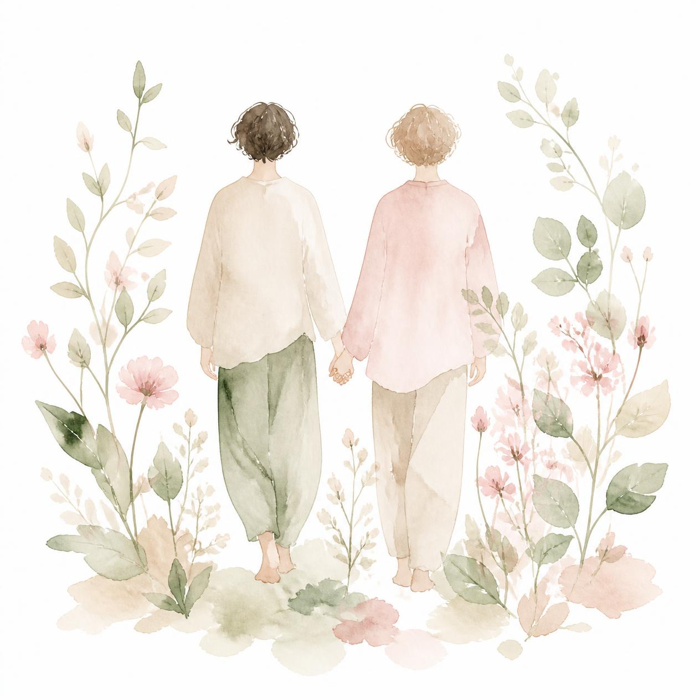
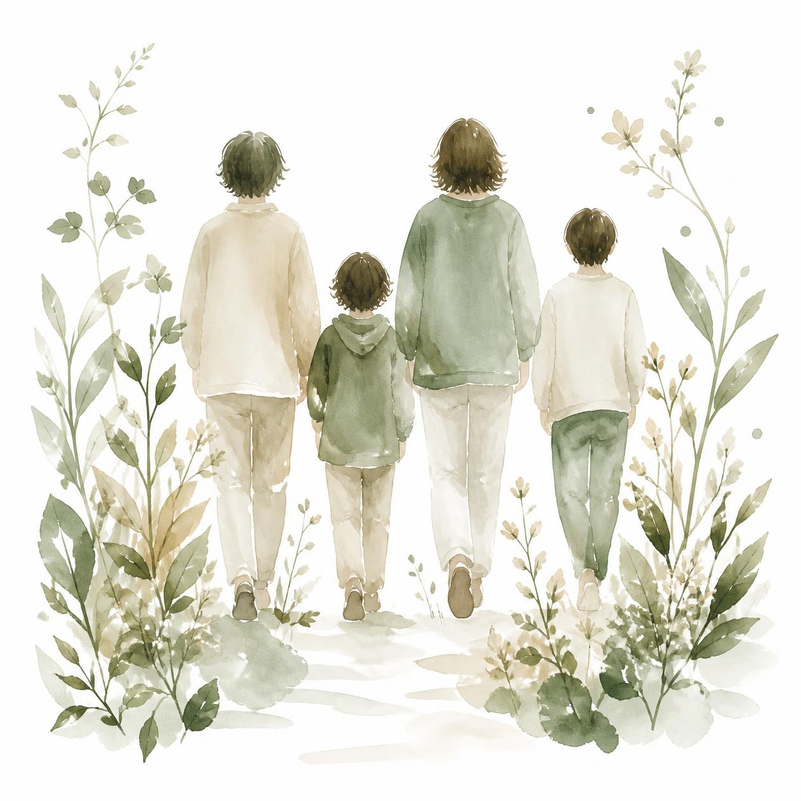

::: {.hero}

::: {.hero-text}

Uno spazio da costruire insieme

Ogni percorso psicologico è un'opera a più mani: non si tratta soltanto di capire cosa ci ha portati fin qui o di lenire il dolore del passato, ma di **co-costruire attivamente qualcosa di nuovo**.

[Per un primo colloquio conoscitivo](#contatti){.contact-button}

:::

::: {.hero-image}

::: {.hero-signature}
Dott.ssa Claudia Virginia Manara
:::
:::

:::

<!-- CHI SONO -->
::: {.section-container .about-section}

## Chi sono {#chi-sono}

Sono la dottoressa Claudia V. Manara, psicologa laureata in Neuropsicologia e Psicologia Clinica presso l'Università degli Studi di Trieste.

Attualmente sto frequentando la Scuola di Specializzazione in Psicoterapia Sistemico Relazionale presso il Centro Padovano di Terapia della Famiglia, nella sede di Trieste.
Inoltre, sto concludendo il dottorato di ricerca in Neuroscienze e Scienze Cognitive presso l’Università degli Studi di Trieste.

Nel 2026 ho completato il primo livello di formazione *Eye Movement Desensitization and Reprocessing* ([EMDR](https://emdr.it/)).

:::

<!-- IL PERCORSO INSIEME -->
::: {.soft-background}
::: {.section-container}

## Il percorso insieme {#percorso-e-servizi}

Nessuna difficoltà nasce nel vuoto: quello che ci accade prende forma dentro una storia, nelle relazioni che viviamo e nei contesti a cui apparteniamo.

Lavoro secondo l’*approccio sistemico-relazionale*, che considera ciò che viviamo non come qualcosa che appartiene esclusivamente all’individuo, ma come un’esperienza che può essere compresa alla luce della propria storia e delle proprie relazioni.

::: {.service-grid}

::: {.service-card}

Umore ed Emozioni

- Periodi di tristezza, stanchezza e perdita di interesse per ciò che prima dava piacere
- Oscillazioni dell’umore e difficoltà a comprendere ciò che le accompagna
- Sensazione di vuoto, disorientamento o perdita di significato
- Emozioni intense e difficili da riconoscere, esprimere e condividere
- Dare un senso a ciò che si prova e trovare nuovi modi per stare con le proprie emozioni

:::

::: {.service-card}

Relazioni e Legami

- Sentirsi poco compresi o non riuscire a trovare le parole per esprimere ciò che si prova
- Ritrovarsi in relazioni che sembrano riproporre dinamiche già vissute
- Desiderare vicinanza e, allo stesso tempo, temerla
- Paura dell’abbandono, difficoltà a fidarsi o bisogno costante di conferme
- Comprendere il proprio modo di entrare in relazione e ciò che accade nello spazio tra sé e l’altro

:::

::: {.service-card}

Spazio di coppia

- Conflitti che si ripetono senza trovare una via d’uscita
- Sentirsi lontani pur continuando a cercarsi
- Difficoltà a parlare di ciò che si prova, si desidera o si teme
- Crisi legate a cambiamenti, tradimenti, separazioni o perdita della fiducia
- Cercare un nuovo modo di stare nella relazione, senza perdere di vista né sé né l’altro

:::

::: {.service-card}

Relazione con Sé ed Identità

- Sentirsi inadeguati, non abbastanza o costantemente sotto giudizio
- Faticare a riconoscere ciò che si desidera, ciò di cui si ha bisogno o ciò che si sente
- Difficoltà nel porre limiti senza sentirsi in colpa
- Vivere secondo aspettative e immagini di sé costruite nel tempo
- Interrogarsi su chi si è e su chi si vuole diventare

:::

::: {.service-card}

Famiglia e Transizioni

- Difficoltà nel dialogo tra genitori e figli o tra generazioni diverse
- Tensioni che emergono nei momenti di cambiamento della vita familiare
- Separazioni, nuove configurazioni familiari o passaggi che richiedono una nuova organizzazione
- Ruoli, aspettative e modalità di relazione che nel tempo sono diventati difficili da modificare
- Comprendere ciò che sta cambiando e trovare nuovi modi di stare in relazione

:::

::: {.service-card}

Studio, Lavoro e Progettualità

- Sentirsi sopraffatti dalle richieste dello studio o del lavoro
- Blocchi, insicurezza o paura di non essere all’altezza
- Difficoltà nelle relazioni e nei contesti scolastici o professionali
- Momenti in cui scegliere una direzione sembra particolarmente difficile
- Interrogarsi sul proprio percorso, sulle proprie possibilità e su ciò che si desidera costruire

:::

:::

:::
:::

<!-- DESTINATARI -->
::: {.section-container}

## A chi mi rivolgo {#destinatari}

::: {.target-grid}

::: {.target-card}

### Individuo

Per chi sta attraversando momenti di sofferenza emotiva, fasi di cambiamento o desidera sviluppare una maggiore consapevolezza di sé e delle proprie risorse.
:::

::: {.target-card}

### Coppia

Per le coppie che vivono momenti di stallo, difficoltà comunicative o che desiderano riorganizzare il proprio legame e la fiducia reciproca.
:::

::: {.target-card}

### Famiglia

Per i nuclei familiari che affrontano fasi di transizione, conflitti generazionali o che cercano nuove modalità di cooperazione ed equilibrio.
:::

:::

:::

<!-- BONUS -->
::: {.bonus-section #bonus}

## Bonus Psicologico Studenti FVG

Aderisco al [Bonus Psicologico Studenti FVG](https://www.ardis.fvg.it/contenuti.php?id=342&view=page) e sono inserita nell’elenco dei professionisti accreditati.

:::

<!-- CONTATTI (SFONDO CHIARO STANDARD) -->
::: {.contact-section #contatti}

## Contatti

I colloqui possono essere svolti **in presenza** presso lo studio di Trieste o **online**, tramite piattaforma sicura e riservata.

Per richiedere informazioni o fissare un primo colloquio puoi contattarmi attraverso i recapiti indicati di seguito:

::: {.contact-grid}

::: {.contact-item .contact-phone}

### Telefono

[+39 335 805 1011](tel:+393358051011)

:::

::: {.contact-item .contact-email}

### Email

[claudiavirginiamanara@gmail.com](mailto:claudiavirginiamanara@gmail.com)

:::

::: {.contact-item .contact-studio .full-width}

### Studio

Trieste (TS)
:::

:::

:::

<!-- FOOTER (ESTERNO E FULL-WIDTH VIA CSS) -->
::: {.footer-section}

::: {.footer-grid}

::: {.footer-col}
### Dott.ssa Claudia Virginia Manara

Psicologa e Specializzanda in Psicoterapia Sistemico-Relazionale  
Formazione EMDR
:::

::: {.footer-col}
### Contatti

[+39 335 805 1011](tel:+393358051011)  
[claudiavirginiamanara@gmail.com](mailto:claudiavirginiamanara@gmail.com)  
Trieste (TS)
:::

::: {.footer-col}
### Informazioni

P.IVA: 01305600072  
Ordine degli Psicologi del Friuli Venezia Giulia — Albo n. 2553  
Specializzanda presso il Centro Padovano di Terapia della Famiglia (sede di Trieste)

[Privacy Policy](privacy.html){.footer-link}
:::

:::

::: {.footer-bottom}
Il sito ed i relativi contatti non sono destinati alla gestione delle emergenze.  
In caso di emergenza è necessario contattare il numero unico di emergenza 112.  
 
© Dott.ssa Claudia Virginia Manara — Tutti i diritti riservati
:::

:::